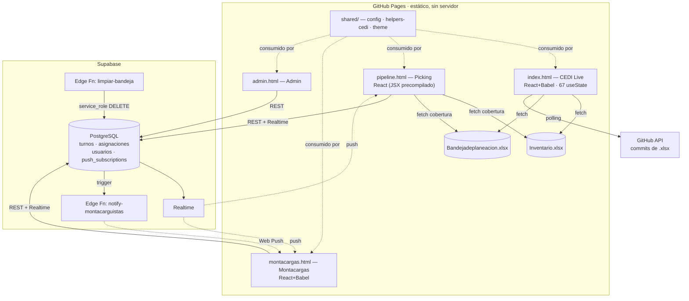

# 🏛️ Arquitectura — INDUCASCOS Dashboard

> Estado al 30-Jun-2026. Sistema estático (GitHub Pages) + Supabase (PostgREST/Realtime).

## Diagrama (Mermaid)

## Flujo de datos
| Dato | Fuente de verdad | Cómo llega | Frescura |
|---|---|---|---|
| Inventario | `Inventario.xlsx` (manual) | `fetch` cliente + parseo XLSX | = última subida |
| Pedidos | `Bandejadeplaneacion.xlsx` (manual) | `fetch` cliente | = última subida |
| Turnos / asignaciones | Supabase | REST + Realtime | Tiempo real |
| Usuarios / suscripciones | Supabase | REST | Tiempo real |

> ⚠️ **Doble fuente de verdad:** inventario/pedidos (Excel) viven aparte de turnos/asignaciones (Supabase). CEDI Live no es "live": es el snapshot del último `.xlsx`.

## Capas
- **Presentación:** React 18 (CDN). `index`/`montacargas`/`admin` con Babel en navegador (→ precompilando); `pipeline` ya precompilado.
- **Lógica compartida (`shared/`):** `config.js` (Supabase + `_go`), `helpers-cedi.js` (familia, calles, cobertura, clasificación, filtros), `theme.js` (paletas). Tests en `helpers-cedi.test.js` (CI).
- **Datos:** PostgREST (API) + 2 Edge Functions (Deno). Excel como pseudo-BD de solo lectura.

## Integraciones externas
| Integración | Uso |
|---|---|
| Supabase REST/Realtime | CRUD y eventos de turnos/asignaciones |
| Supabase Edge Functions | Web Push, limpieza de bandeja |
| GitHub API | Detectar nueva versión de los `.xlsx` |
| Web Push (VAPID) | Notificaciones a montacarguistas |
| CDNs (React, Babel, XLSX) | Librerías sin bundler |

## PWA
3 manifests con `id`/`scope` propios (CEDI/Picking/Montacargas) + `sw.js` (push). Cada app instalable por separado.

## Deuda estructural (resumen)
1. Doble fuente de verdad (Excel manual).
2. Lógica de negocio antes triplicada → en consolidación a `shared/`.
3. God Components (index 614 KB / 67 useState).
4. Sin build/bundler (todo inline + CDN).

Ver `AUDITORIA.md` (scores y roadmap) y `supabase/security/` (plan de seguridad).
